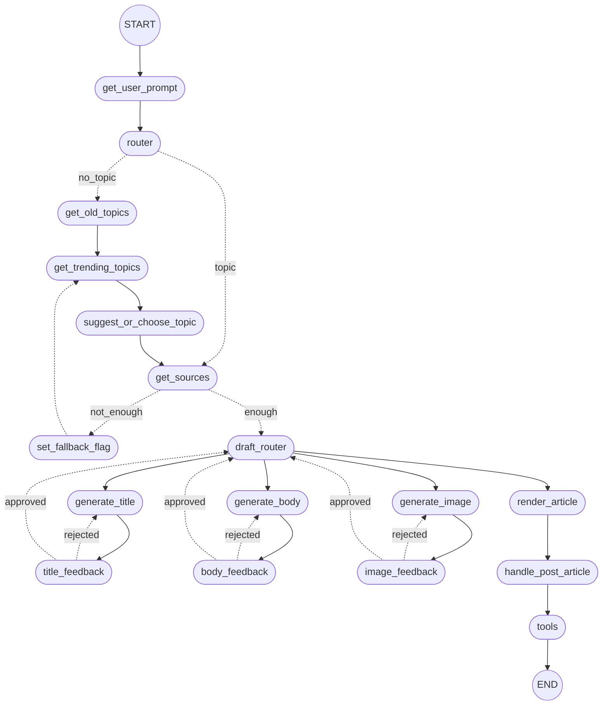

# LangGraph AI Article Agent

> Genera articoli completi (titolo, corpo, immagine) partendo da un semplice prompt, sfruttando **LangGraph** e **LangChain** per orchestrare un agente conversazionale con memoria e strumenti di produzione.

## Perché questo progetto
Il notebook `agent.ipynb` dimostra come:
- Modellare un **workflow non‑lineare** in cui diversi step vengono eseguiti o saltati dinamicamente grazie a _state graph_ e _conditional edges_.
- Integrare **LLM OpenAI**, **ricerche sul web** (Tavily) e **tool esterni** (PDF/Markdown) in un unico agente.
- Tracciare tutto con **Langfuse** e persistere la memoria su **PostgreSQL**.

## Architettura ad alto livello
Il cuore dell'applicazione è uno **StateGraph** di LangGraph. Ogni nodo è una funzione Python pura che riceve e restituisce uno _state object_ tipizzato.

### Diagramma del flusso


### Descrizione dei nodi principali
* **get_user_prompt** – Prende l'input iniziale dell'utente, che può già contenere un topic.
* **router** – Decidi se estrarre un argomento oppure chiamare lo strumento per ottenere gli argomenti di tendenza. Se l’utente ha fornito chiaramente un argomento, estrailo; in caso contrario, vai al nodo get_trending_topics.
* **get_old_topics** – Recupera e filtra i vecchi argomenti dal database.
* **get_trending_topics** – Interroga Tavily per gli argomenti di tendenza.
* **suggest_or_choose_topic** – Suggerisce o fa scegliere il topic all'utente.
* **get_sources** – Recupera link e articoli pertinenti al topic scelto.
* **set_fallback_flag** – Imposta un flag per ripiegare sui topic trending.
* **draft_router** – Instrada il flusso sui task di generazione (titolo, body, immagine, rendering) in base allo stato corrente.
* **generate_title** – Crea un titolo provvisorio per il draft.
* **generate_body** – Crea il corpo bozza dell'articolo.
* **generate_image** – Crea un prompt e genera un'immagine di copertina.
* **title_feedback** – Raccoglie feedback sul titolo e decide se rigenerarlo.
* **body_feedback** – Raccoglie feedback sul corpo e decide se rigenerarlo.
* **image_feedback** – Raccoglie feedback sull'immagine e decide se rigenerarla.
* **render_article** – Converte bozze in HTML finale per l'esportazione.
* **handle_post_article** – Salva l'articolo, pulisce lo stato e decide se chiamare i tool di generazione di file PDF/Markdown.
* **tools** – Nodo Tool che espone funzioni di esportazione PDF/Markdown.

## Prerequisiti
```bash
python >= 3.10
pip >= 23
```

## Installazione
1. Clona il repository https://github.com/Mazzoldi/CCAI oppure scarica il singolo notebook `agent.ipynb`.
2. Installa le dipendenze (dalla prima cella del notebook o via `requirements.txt`):
   ```bash
   pip install langgraph langchain langchain_openai langchain_community psycopg2-binary fpdf nest_asyncio tavily-search
   pip install -q langfuse
   ```
3. Prepara un file `.env` (o esporta variabili d'ambiente) con le seguenti chiavi **obbligatorie**:
   ```env
   GOOGLE_API_KEY=...
   GOOGLE_CSE_ID=...
   LANGFUSE_HOST=...
   LANGFUSE_PUBLIC_KEY=...
   LANGFUSE_SECRET_KEY=...
   OPENAI_API_KEY=...
   POSTGRES_DB_NAME=...
   POSTGRES_HOST=...
   POSTGRES_PASSWORD=...
   POSTGRES_PORT=...
   POSTGRES_USER=...
   SERPAPI_API_KEY=...
   TAVILY_API_KEY=...
   ```
   In esecuzione, il notebook chiederà in input le variabili mancanti usando la funzione `_set_env()`.

## Avvio rapido
```bash
jupyter lab agent.ipynb  # oppure
python -m nbconvert agent.ipynb --to python && python agent.py
```
All'avvio l'agente ti chiederà un **prompt** per l'articolo. Se non specifichi un topic chiaro (o se su di esso non troverà abbastanza fonti) proverà a recuperare argomenti *trending* dal web.

### Output
* Cartella `generated_articles/` con:
  * `<timestamp>_titolo.pdf` – articolo impaginato in PDF
  * `article_<timestamp>.md` – versione Markdown
* Log dettagliati in **Langfuse** per ogni run.

## Estendere l'agente
**Aggiungere tool**: è possibile aggiungere tool alla fine, come ad esempio la pubblicazione su un social dell'articolo (Instagram, X).

## Note sui costi
- Ogni chiamata a OpenAI conteggia token: imposta `temperature` e `model` in base al tuo budget.
- Disattiva il recupero di trending topic se vuoi evitare chiamate HTTP extra.
