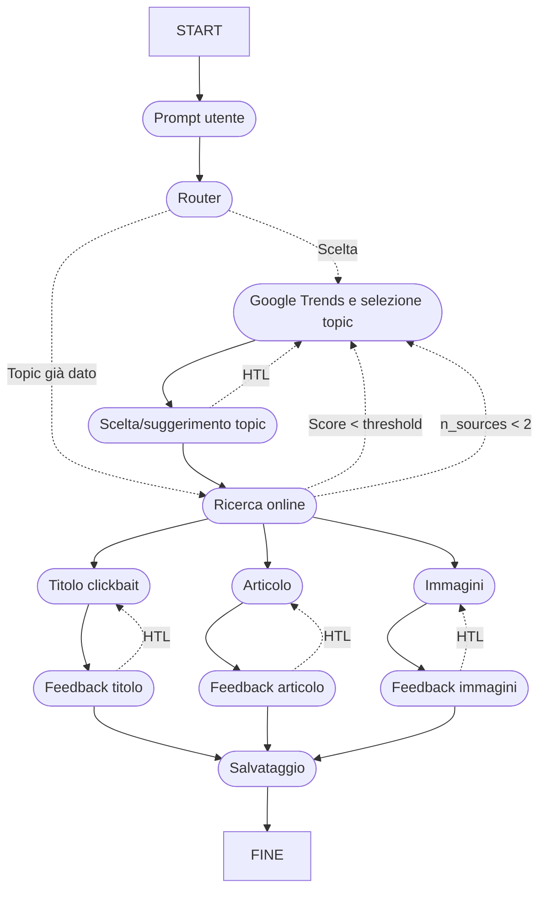

```mermaid
graph
A[START] --> B([Prompt utente])
B --> C([Router])
C -. Scelta .-> D([Google Trends e selezione topic])
C -. Topic già dato .-> F([Ricerca online])
D --> E([Scelta/suggerimento topic])
E -. HTL .-> D
E --> F
F -. Score < threshold .-> D
F -. n_sources < 2 .-> D
F --> I([Titolo clickbait])
F --> K([Articolo])
F --> M([Immagini])
I --> J([Feedback titolo])
J -. HTL .-> I
J --> O([Salvataggio])
K --> L([Feedback articolo])
L -. HTL .-> K
L --> O
M --> N([Feedback immagini])
N -. HTL .-> M
N --> O
O --> P[FINE]
```